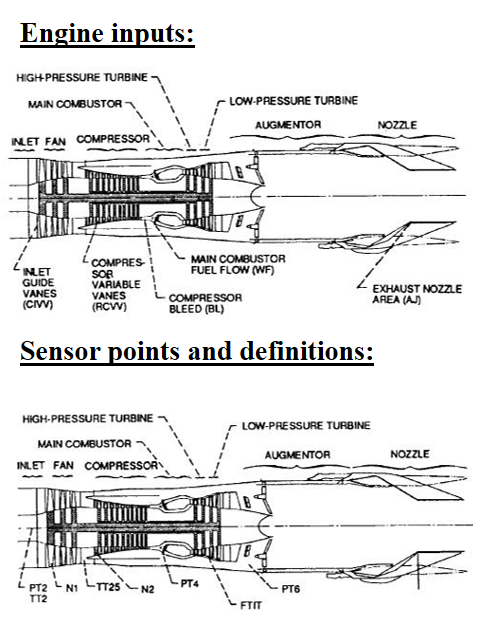
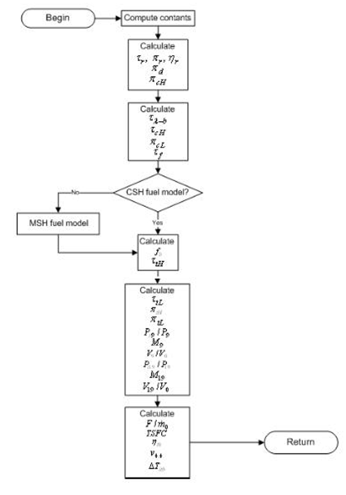
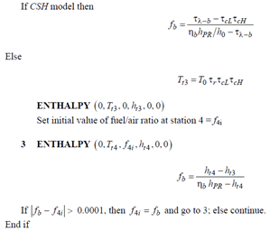
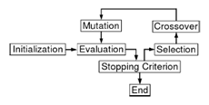
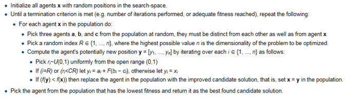
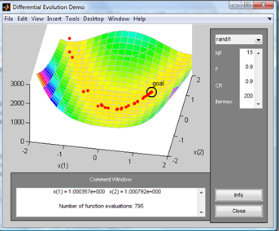

# Table of Contents
1. [Introduction](README.md#introduction)
2. [Implementation details](README.md#implementation-details)
3. [References](README.md#References)

# Introduction

This repository calculates and optimize the Specific Thrust of un-mixed flow dual spool Turbofan Engines based on the method described in [1]. The schematic of a typical engine is shown below:

The repository contains 6 files: 

1-	Constant_Specific_Heat.m: This function uses the High Pressure (HP) compressor pressure ratio as an input and computes the Specifc Fuel Consumption (SFC); Constant Specific Heat (CSH) model was incorporated.

2-	Modified_Specific_Heat_Constraint.m: uses HP compressor pressure ratio, By-pass ratio, and Fan pressure ratio as inputs to compute the Specific Thrust for an un-mixed flow dual spool Turbofan Engine; Modified Specific Heat (MSH) model was incorporated.

3-	Tamb.m: computes the Standard Tempreture in the atmosphere as a function of height.

4-	enthalpy.m: computes enthalpy of the combustible mixture as a function of Tempreture & fuel-air ratio.

5-	Differential_Evolution.m: Differential Evolution (DE) code for a stochastic minimization of continuous space functions that may be non-differentiable, nonlinear and multimodal [2].

6-	dedmov.m: a demo demonstration of DE minimization of Rosenbrock''s "banana function" [2].             

# Implementation details

SFC and Specific Thrust are calculated using the following flow chart:

CSH and MSH fuel models are as described below:

The following chars shows the top view procedures performed in DE optimization:

The pseudo-code for DE is shown below:

The following demonstration shows the minimization of Rosenbrock''s "banana function":

f(x)= 100(x(2)-x(1)^2)^2+(1-x(1))^2  by DE method which requires just 3 control variables:                              
  

1-	Number of population members (NP)

2-	Difference vector weight (F) example: [0, 2]

3-	Crossover probability (CR) example: [0, 1]              

As a first guess NP=10(number of parameters) is usually a good choice.   

# References

[1]	Mattingly, J. D., Boyer, K. M., & von Ohain, H. (2006). Elements of propulsion: gas turbines and rockets

[2]	http://www1.icsi.berkeley.edu/~storn/code.html

## Author

* **Abtin Ansari** [author](https://www.linkedin.com/in/abtin-ansari-55b0953a/)

